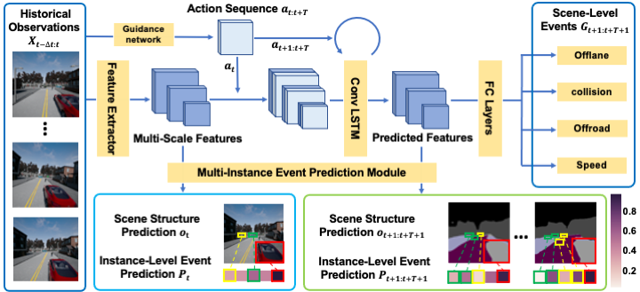
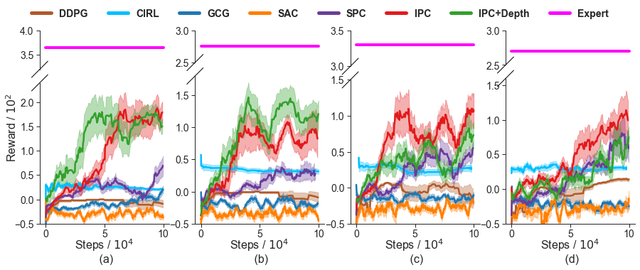
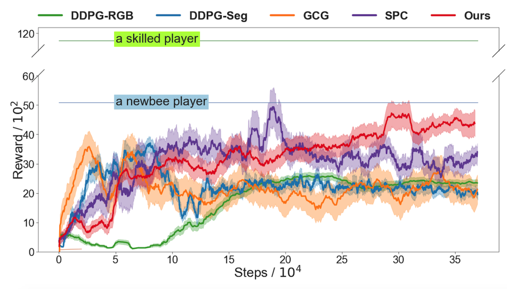

# IPC: Instance-Aware Predictive Control

This repo is for the paper [Instance-Aware Predictive Navigation in Multi-Agent Environments](https://arxiv.org/abs/2101.05893). 

## Overview



**Instance-Aware Predictive Control (IPC)** is a predictive control model to gain driving policy in multi-agent driving environments. It follows a "forecasting + planning" philosophy to control the agent in three steps:

1. sample action candidates, which is encouraged by a guidance network, imitating the agent's previoud good experience.
2. use sampled action candidates and sensor observation to predict the action's consquences, namely future visual structure and probability of states of interest, such a s agent speed and chance of collision etc.
3. Use cost function to estimate the preference of different sampled action sequences. Only one sequence will be selected and its action on the current step will be executed.

**Please see the explanation and demo video [here](https://drive.google.com/file/d/1FpuutMCMunenzes73j0uDlYVxsLRG1Oz/view?usp=sharing)**

## Usage

### Training

To train **IPC**, you need the collaboration of python programs and the simulator because it train fully online in the driving environment. 

#### Python-side

We provide one-step trainings script to starting training simply by: 

``` bash
cd scripts/
bash train_#ENVNAME.sh
```

Note, we mainly work on [CARLA](carla.org) stable version (0.8.4). But we also support experimental CARLA9 whose subversion is no later than 0.9.6. Moreover, GTA V environment is suported by the [DeepGTAV](https://github.com/aitorzip/DeepGTAV) plugin. We are still tuning code on CARLA9 and GTA V. To use different environments, simply set the flag when booting scripts:

``` bash
--env carla8 / carla9
```

As GTA only supports Windows platform, we provide a script **scripts/train_gta.bat** to run it.

#### Simulator-side

We found some issues between communication between CARLA simulator and the python program on some machines. So we also provide a docker environment to help workd around the environment issue where the CARLA 0.8.4 simulator has been built inside. Get it by

``` bash
docker pull deepdrive/spc
```

To boot CARLA on Linux, a default command is 

``` bash
SDL_VIDEODRIVER=offscreen SDL_HINT_CUDA_DEVICE=0 ./CarlaUE4.sh -carla-settings=Example.CarlaSettings.ini -windowed -ResX=256 -ResY=256 -carla-server -carla-no-hud
```

Or on windows:

``` bash
CarlaUE4.exe -windowed -ResX=800 -ResY=600 -carla-server -carla-no-hud -carla-settings=Example.CarlaSettings.ini
```

In the provided docker image, you could simply start the CARLA simulator by run

```bash
bash carla_0.8.4/run.sh
```

#### Offline datasets

Besides the default online training, we also provide [a dataset](https://drive.google.com/file/d/1gYXt1FMm3XGsit9RgT728_27BQ0J7Slq/view?usp=sharing) collected on CARLA 0.8.4 for offline pretraining or other usage. On CARLA, we could extract semantic segmentation and vehicle bounding boxes for supervision. While on GTA.V, no such convenient APIs are provided. We turn to train a [Mask R-CNN](https://github.com/matterport/Mask_RCNN) model on [a GTA V dataset](https://download.visinf.tu-darmstadt.de/data/from_games/) to provide pseudo-supervision.

### Evaluation

We evaluate **IPC** on CARLA and GTA V simulators. The evaluation metrics follow the reward function defined in a previous work [SPC](https://go.yf.io/spc-paper).  

The evaluation result on CARLA is shown below. *Expert* is the built-in autopiot agent in CARLA.



The evaluation result on GTA V is shown below.



## Citation

```
@article{cao2021instance,
  title={Instance-Aware Predictive Navigation in Multi-Agent Environments},
  author={Cao, Jinkun and Wang, Xin and Darrell, Trevor and Yu, Fisher},
  journal={arXiv preprint arXiv:2101.05893},
  year={2021}
}
```

